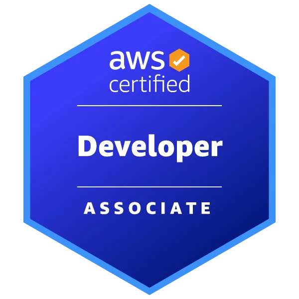

# AWS Certified Developer Associate (DVA-C02)
## Resumo Executivo do Material de Estudos

**Sobre o Material**

Este guia estratégico foi desenvolvido para auxiliar desenvolvedores na preparação para o exame AWS Certified Developer Associate (DVA-C02). O material completo está disponível gratuitamente no GitHub e inclui resumo técnico, simulado prático e recursos de estudo.

**Acesse o material completo no GitHub:** 

**[AWS Certified Developer Associate (DVA-C02)](https://github.com/klerytondev/aws-certified-developer-associate-dva-c0)**

**Estrutura do Exame**
- **65 questões** | **130 minutos** | **720/1000 pontos** para aprovação
- **Formato:** Múltipla escolha, múltiplas respostas, ordenação e associação
- **Realização:** Pearson VUE (online ou presencial)

**Domínios de Conhecimento**

| Domínio | Peso | Principais Tópicos |
|---------|------|-------------------|
| **Desenvolvimento com AWS** | 32% | Lambda, API Gateway, SQS/SNS, DynamoDB, EventBridge, Step Functions |
| **Segurança** | 26% | IAM, Cognito, KMS, Secrets Manager, Parameter Store, Criptografia |
| **Implantação** | 24% | CodePipeline, CodeBuild, CodeDeploy, CloudFormation, AWS SAM, CDK |
| **Troubleshooting** | 18% | CloudWatch, X-Ray, Otimização, Debug, Monitoramento |

**Serviços AWS Essenciais**

- **Lambda:** Computação serverless, cold start, idempotência, gatilhos diversos
- **API Gateway:** REST/HTTP APIs, autorização, cache, throttling, stages
- **DynamoDB:** NoSQL, GSI/LSI, Query vs Scan, throughput, streams
- **S3:** Object storage, encryption, lifecycle, triggers, versioning
- **SQS/SNS:** Messaging, desacoplamento, DLQ, filtros, pub/sub
- **EventBridge:** Event routing, microserviços, filtros avançados
- **IAM/Cognito:** Autenticação, autorização, roles, políticas, JWT
- **CloudWatch/X-Ray:** Monitoring, distributed tracing, alarmes, logs

**Dicas Estratégicas**

✅ **Foque no prático:** Conhecimento hands-on de integrações AWS  
✅ **Segurança:** Princípios de menor privilégio, roles vs credenciais fixas  
✅ **CI/CD:** Estratégias de deployment (blue/green, canary, rolling)  
✅ **Arquitetura:** Padrões serverless, event-driven, microsserviços  
✅ **Performance:** Otimização de custos, cache, monitoring proativo  

**Conteúdo do Material (Disponível no GitHub)**

- **Guia Técnico Completo:** Resumo estratégico detalhado dos 4 domínios
- **Simulado Prático:** 65 questões com respostas explicativas completas
- **Cenários Reais:** Casos de uso práticos e troubleshooting avançado
- **Links Úteis:** Documentação oficial AWS, Skill Builder e recursos extras
- **Tabela de Referência:** Quick reference completa dos principais serviços

**Como acessar o material:**
1. Link no primeiro comnetário

**Público-Alvo**

Desenvolvedores com experiência em pelo menos uma linguagem de programação que desejam validar conhecimentos em desenvolvimento de aplicações na AWS.

**Material 100% Gratuito no GitHub - Compartilhe com sua equipe!**

**Pré-requisitos Recomendados**
- Experiência com AWS Core Services
- Conhecimento de arquiteturas cloud
- Familiaridade com DevOps e CI/CD
- Experiência prática com desenvolvimento

© 2025 · Curadoria de **Kleryton de Souza** · Siga no [LinkedIn](https://www.linkedin.com/in/kleryton-souza/)  
Repositório do guia: https://github.com/klerytondev/
Baseado em pesquisa e experiência AWS · Fique à vontade para compartilhar com colegas · Não para revenda
